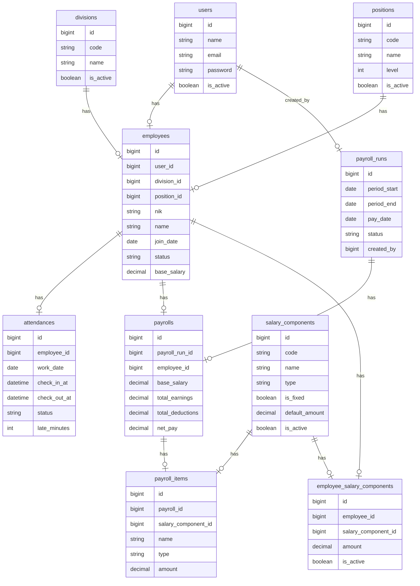
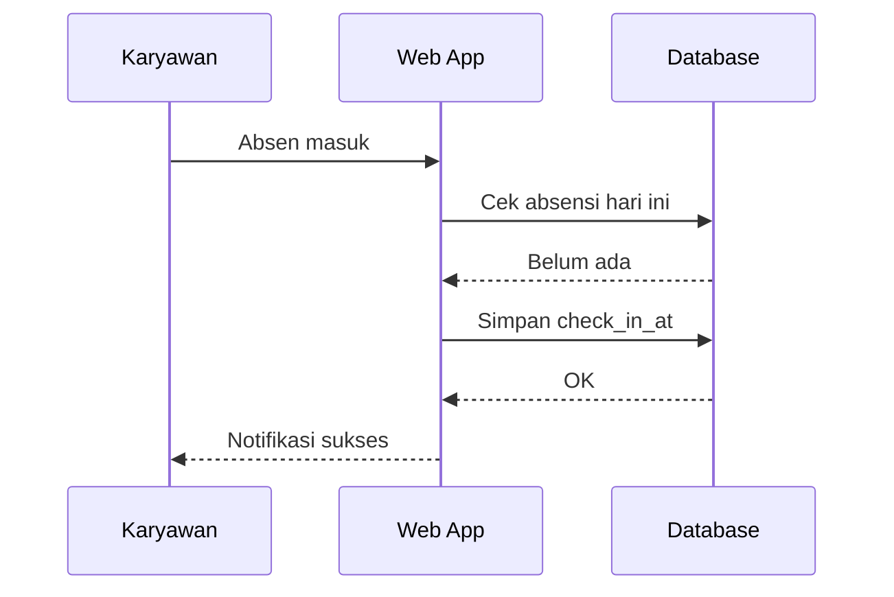
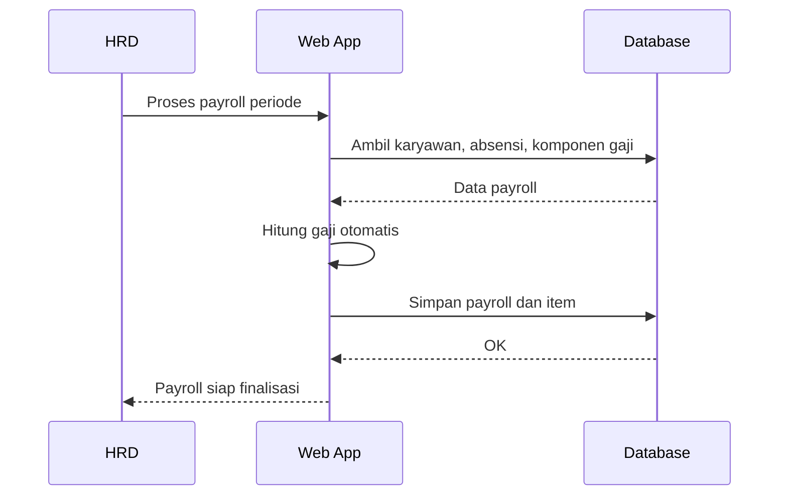

# Sistem Penggajian & Absensi Karyawan

Dokumen ini merangkum struktur folder, ERD, flow sistem, endpoint API, dummy data, dan best practice keamanan.

## Struktur Folder (ringkas)
- app/Http/Controllers: controller untuk web dan API
- app/Models: model Eloquent
- app/Domain: entity dan aturan bisnis inti
- app/Application: use case, service, dan orchestrator
- app/Infrastructure: repository, integrasi eksternal, dan implementasi storage
- database/migrations: skema database
- database/seeders: data dummy
- resources/views: UI Blade + Tailwind
- routes: rute web dan API
- docs: dokumentasi proyek

## ERD (Mermaid)

## Flow Sistem
### Absensi
1. Karyawan login dan membuka halaman absensi.
2. Sistem cek status absensi hari ini.
3. Absen masuk/pulang disimpan otomatis dengan waktu server.
4. Sistem hitung keterlambatan berdasarkan jam kerja.
5. HRD melihat rekap absensi bulanan dan status kehadiran.

### Penggajian
1. HRD pilih periode gaji.
2. Sistem tarik data karyawan, komponen gaji, dan absensi.
3. Hitung pendapatan dan potongan otomatis.
4. HRD review dan finalisasi payroll.
5. Slip gaji dibuat dan dapat diunduh karyawan.

## Sequence Flow (Mermaid)
### Absensi

### Penggajian

## Endpoint API (v1)
- Auth
  - POST /api/v1/auth/login
  - POST /api/v1/auth/logout
- Karyawan
  - GET /api/v1/employees
  - POST /api/v1/employees
  - GET /api/v1/employees/{id}
  - PATCH /api/v1/employees/{id}
  - DELETE /api/v1/employees/{id}
- Absensi
  - GET /api/v1/attendances
  - POST /api/v1/attendances/check-in
  - POST /api/v1/attendances/check-out
  - GET /api/v1/attendances/recap
- Penggajian
  - GET /api/v1/payroll-runs
  - POST /api/v1/payroll-runs
  - GET /api/v1/payrolls
  - GET /api/v1/payrolls/{id}
  - GET /api/v1/payrolls/{id}/slip
- Laporan
  - GET /api/v1/reports/attendance
  - GET /api/v1/reports/payroll
- Pengaturan
  - GET /api/v1/settings/work
  - PATCH /api/v1/settings/work
  - GET /api/v1/settings/salary-components
  - PATCH /api/v1/settings/salary-components

## Dummy Data
- Admin: admin@company.test / password
- HRD: hrd@company.test / password
- Karyawan: karyawan1@company.test / password (karyawan2/3 juga ada)
- Divisi: Finance, Human Resource, Engineering
- Jabatan: Manager, Staff, Analyst
- Komponen gaji: Gaji Pokok, Tunjangan, Bonus, Keterlambatan, BPJS, Pajak

## Best Practice Keamanan
- Gunakan RBAC untuk semua rute sensitif.
- Validasi input dengan FormRequest.
- Lindungi endpoint dengan CSRF dan rate limiting.
- Gunakan hashing password bawaan Laravel.
- Audit log untuk perubahan payroll dan pengaturan.
- Batasi ekspor data sensitif dan beri watermark PDF.
